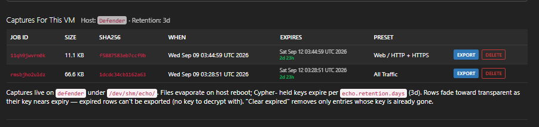

# kvm-echo

A plugin for **Morpheus / HPE VM Essentials, Advanced, Enterprise** that adds per-VM packet
capture on KVM hosts, with the pcap encrypted before it ever touches disk.


*The capture form on a HVM hypervisor's kvm-echo tab. The interface list comes from
`ip link` on the host; on a VM's tab it comes from `virsh domiflist` instead.*

---

## Why

Capturing packets for a VM on a HVM hypervisor today means SSHing to the host, working out
which `vnet` interface belongs to which guest, running `tcpdump` by hand, then getting the
pcap off the box — usually leaving a cleartext capture sitting on the hypervisor's disk
along the way, and usually forgetting to clean it up.

That last part is the real problem. A packet capture is one of the most sensitive artifacts
a platform can produce: credentials, session tokens, and internal traffic in the clear. The
convenient workflow and the safe workflow point in opposite directions.

This plugin puts the whole thing in the Morpheus UI, in the same place you already manage
the VM. `tcpdump` output is piped straight into AES-256-GCM encryption before anything is
written down, so the ciphertext is the only form that ever exists on the hypervisor. The
appliance decrypts on demand when you click download, and hands you a standard pcap.

## What you get

| | |
|---|---|
| **Per-VM or per-host capture** | Pick any interface — physical NIC, bridge, or a specific guest's `vnet` tap |
| **Never-cleartext-on-disk** | `tcpdump` piped into AES-256-GCM AEAD; ciphertext lands on tmpfs |
| **Appliance-side decrypt** | Download button decrypts and serves the pcap; AES key never leaves the JVM |
| **Wireshark-compatible** | Standard pcap format, opens directly |
| **Interactive or scheduled** | Host / VM tab for ad-hoc, Automation Task for Workflow + Job scheduling |
| **48 capture presets** | Common traffic types — web, SSH, DNS, storage, database, overlay — as ready-made BPF filters, or write your own |
| **Integrity gate** | Every export byte-verified against host-computed SHA-256 before decrypt |


*A completed capture. The jobId is the anchor for every log line on both the appliance and
the host — quote it in any bug report.*


*Captures on a host, with the preset each one used. Rows fade as they approach expiry —
once a capture's key lapses, its ciphertext is unrecoverable by design.*


*Export decrypts on the appliance and hands back a standard pcap — no conversion step.*

## Filtering

Every capture can be scoped with a standard `tcpdump` BPF filter, either typed directly or
chosen from a dropdown of 48 presets grouped by traffic type: web, remote access,
infrastructure, storage, database, virtualization, container, messaging, email, and
diagnostics.

Filters are applied at capture time, on the host, before anything is encrypted or written —
so a scoped capture is smaller on tmpfs, faster to export, and contains less than an
unfiltered one ever did. That is a confidentiality property, not just a convenience.


*The same interface captured twice — unfiltered, and scoped to broadcast/multicast traffic
with a preset.*

## Design constraints

These are hard constraints, not preferences. Anything that violates one is a defect, not a
tradeoff.

**Cleartext pcap never touches disk.** `tcpdump` stdout is piped directly into an AEAD
encryption helper on the host. Ciphertext lands on tmpfs (`/dev/shm`), never on the block
device.

**Encryption keys never appear in argv, environment, command strings, or persistent
filesystem.** A fresh AES-256 key is generated per capture by the appliance, delivered
out-of-band to the host, opened as a file descriptor, and the file is unlinked immediately.
The key material lives only in the descriptor and in the encryption process's memory for
the duration of the capture.

**BPF filters are allowlist-parsed before the capture command is built.** Operator-supplied
filter text is tokenised and checked against an allowlist of `tcpdump` keywords, integers,
and address-shaped identifiers on the host, before `tcpdump` is invoked. Shell
metacharacters are rejected outright, and a rejected filter exits with a distinct code
before the capture pipeline runs. The `tcpdump` argument vector is assembled as an array,
never by string interpolation.

**Ciphertext is integrity-protected against tampering.** Not only per-chunk (via GCM tags)
but against chunk reorder and stream truncation, by binding the chunk index and a finality
flag into the AEAD's associated data. An attacker with write access to a stored capture
cannot silently modify, reorder, or truncate it — each failure mode surfaces as a distinct
error rather than as corrupt output.

## Install

1. Download the jar from the [**Releases**](../../releases/latest) page.
2. In Morpheus: **Administration → Integrations → Plugins**, click Upload, select the jar.
3. Bootstrap each KVM host — two commands, see the [User Guide](docs/USER-GUIDE.md).

> **Upgrading?** Remove the existing plugin before uploading the new jar. Uploading over an
> installed plugin can leave stale classes loaded while reporting success.

### Verify the download

Each release publishes a SHA-256 checksum alongside the jar:

```bash
sha256sum -c kvm-echo-0.8.1-all.jar.sha256
```

## Requirements

| | |
|---|---|
| **Morpheus / HPE VME** | 9.0 or later (plugin API 1.3.1) |
| **Hosts** | HVM hypervisors managed by Morpheus |
| **Host OS** | Ubuntu 24 tested. Earlier Ubuntu likely works; RHEL / other untested |
| **Bootstrap** | `setcap` on `tcpdump`; `morpheus-node` in the `libvirt` group |
| **Account** | Able to run execution requests against those hosts |

Two-step host bootstrap, once per hypervisor. **No NOPASSWD sudoers entry** — the plugin
uses Morpheus's built-in sudo escalation, so there is no host-side sudoers configuration to
write or maintain.

## Documentation

- [**User Guide**](docs/USER-GUIDE.md) — setup, capture walkthroughs for both surfaces,
  export, known issues, troubleshooting
- [**Changelog**](CHANGELOG.md) — version history
- [**Security**](SECURITY.md) — what is stored where, what leaves the host, how to report an issue

## Two things it deliberately does not do

**It does not capture inside the guest.** Everything happens on the HVM host — `tcpdump`
reads the `vnet` tap interface from outside the VM. Guests are unaware and unmodified,
with nothing to install and nothing to keep up to date. The tradeoff is symmetric: it can
capture traffic the guest's own firewall drops, but it cannot decrypt payloads the host
has no key for.

**It does not persist cleartext pcap.** Ciphertext lives on tmpfs on the hypervisor and is
cleared on host reboot. The per-capture AES key lives in Cypher on the appliance and
expires with the configured retention. The plaintext pcap exists only in appliance memory
during the decrypt-and-serve flow. Nothing is written to persistent storage at any stage
without an operator asking for it — which also means there is no cleanup step to forget.

## Support

Community plugin. Not an HPE or Morpheus product, and not certified or supported by either.

Bugs and questions go through [Issues](../../issues) — please use the
[bug report template](.github/ISSUE_TEMPLATE/bug_report.md), and include the `jobId` if the
problem involves a capture or export. It is the anchor for every log line on both sides.

## License

[Apache License 2.0](LICENSE). See [NOTICE](NOTICE) for attribution and trademark statements.

Chosen for the express patent grant in section 3 and the trademark clause in section 6 —
both matter for a plugin distributed as a binary into enterprise environments — and because
it matches the licence Morpheus's own plugin SDK uses.

## Source

This repository distributes the built plugin and its documentation. It does not contain the
plugin source.
