# kvm-echo — User Guide

A Morpheus VME plugin that adds per-VM packet capture on KVM hosts. Everything runs on the
hypervisor (no in-guest agent), the capture is AES-256-GCM encrypted before it ever touches
disk, and the appliance decrypts on demand for download.

This guide covers what you need, how to bootstrap a host, a capture end to end on both
surfaces, and what to do when something goes wrong. For the current version, see the
[Releases](../../releases/latest) page.

---

## What you need

**Appliance side:**

- Morpheus VM Essentials 9.0 or newer
- SSH access to the appliance (for troubleshooting log grabs — not required for normal use)
- The plugin JAR — download from the [Releases](../../releases/latest) page

**KVM host side (where the actual captures run):**

- Ubuntu 24 is what has been tested. Earlier Ubuntu will probably work but is unverified.
  RHEL/other is untested.
- KVM/libvirt/OVS (or Linux bridges) — the standard Morpheus HVM setup
- `morpheus-node` agent installed and reporting to the appliance
- `tcpdump` installed (usually already is)
- Some free RAM in `/dev/shm` — captures land there, cleared on reboot

**No NOPASSWD sudoers entry required.** Earlier versions needed one for wrapper cleanup;
that requirement was retired in 0.7.8. The plugin now uses Morpheus's built-in sudo
escalation to run the wrapper as root directly, without any host-side sudoers configuration.

**VMs to test with:**

- At least one KVM VM running on your test host, with some network traffic on it (ping,
  curl, whatever)
- If you have multiple VMs, better — the plugin's "VM tab" path captures per-guest interface
  (`vnet*`), and the "host tab" path captures anything on the host including physical NICs
  and bridges

---

## Set up your KVM host (one-time)

The plugin auto-detects what's missing and shows you a red panel with copy-paste remedies.
You can skip this section and just navigate to your host in Morpheus — but if you'd rather
set it up first, here's what needs to be there:

```bash
# On each KVM host, as root or via sudo:

# 1. tcpdump needs raw-packet capabilities
sudo setcap cap_net_raw,cap_net_admin=eip /usr/bin/tcpdump

# 2. morpheus-node needs to be in the libvirt group (for domiflist queries)
sudo usermod -aG libvirt morpheus-node
# then restart the morpheus-node service so the group membership takes:
sudo systemctl restart morpheus-node

# 3. Sanity check
getcap /usr/bin/tcpdump          # should show cap_net_raw,cap_net_admin=eip
id morpheus-node                 # should include libvirt group
```

Two-step bootstrap. That's it. (Note that a couple things may drift: `apt upgrade` on the
tcpdump package can wipe the file caps, and libvirt group changes need a service restart to
take effect. The plugin's preflight panel will flag both if they happen.)

---

## Install the plugin

1. In Morpheus: **Administration → Integrations → Plugins**
2. Click Upload, select the plugin JAR
3. Wait a few seconds for it to load. It'll appear in the list as **kvm-echo**.

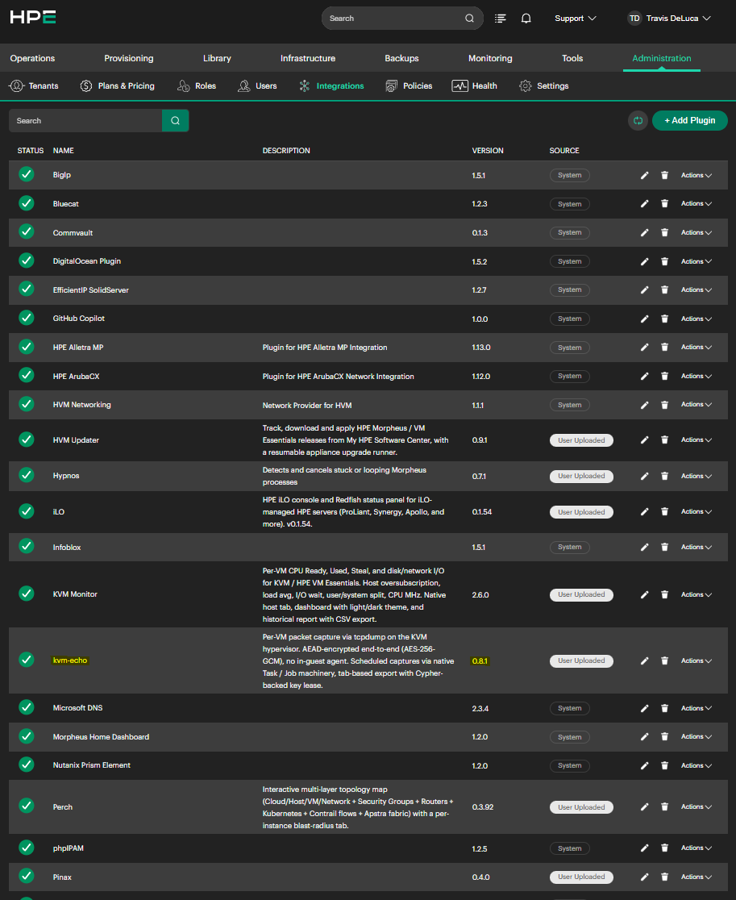
*Administration → Integrations → Plugins. This list is the reliable place to confirm which
version is loaded.*

> ### Upgrading: remove the old plugin first
>
> **Uploading a new JAR over an installed plugin can leave the old classes loaded.** You get
> a successful upload, an audit entry, and a plugin that appears to work — while still
> running the previous version's code. Remove the existing plugin, then upload the new JAR,
> then confirm the version in the plugins list above.
>
> Do not use the version shown in the plugin tab's own footer to check this. It reads a
> manifest field the build doesn't set, and always displays `VDEV` regardless of version.

---

## Capturing from a host or VM tab

This is the interactive surface: you're looking at a specific host or VM, and you want a
capture right now.

### On a KVM host

1. Navigate to **Infrastructure → Compute** and click on a KVM host
2. Click the **kvm-echo** tab
3. **Preflight panel:** if red, it lists exactly which check failed with a copy-paste
   remedy. Fix it and reload the tab. If green or absent, the form appears.
4. Pick an interface — the dropdown lists the host's own NICs, bridges and bonds, read from
   `ip link` on the host, grouped by type
5. Set duration, packet cap and byte cap, or leave the defaults (30s / 10,000 / 10 MB)
6. Optionally pick a capture preset, or type a BPF filter — see [Filtering](#filtering) below
7. Click **START CAPTURE**

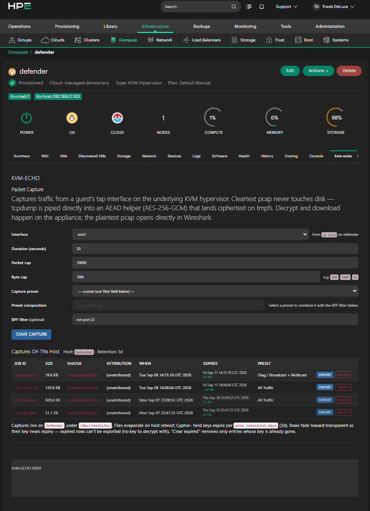
*The host tab capture form. Interfaces come from `ip link` on the host.*

### On a VM

Same flow, but navigate to the guest rather than the host. The interface dropdown shows only
that guest's tap interfaces, read from `virsh domiflist`, so you cannot accidentally capture
a different VM's traffic.

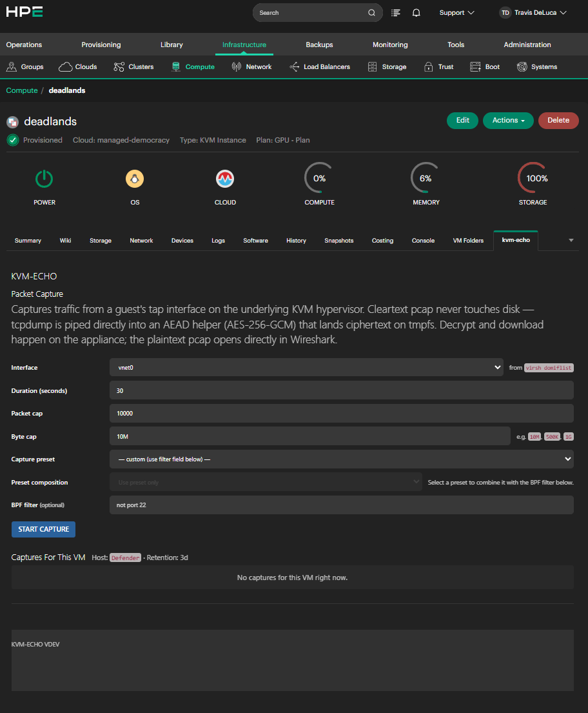
*On a VM's tab, the interface list is scoped to that guest's own taps.*

### Watching it run

The panel moves through STARTING → RUNNING → PASS. While running it shows elapsed time and
bytes written, refreshed as the capture proceeds. Whichever cap is reached first — duration,
packets, or bytes — ends the capture.

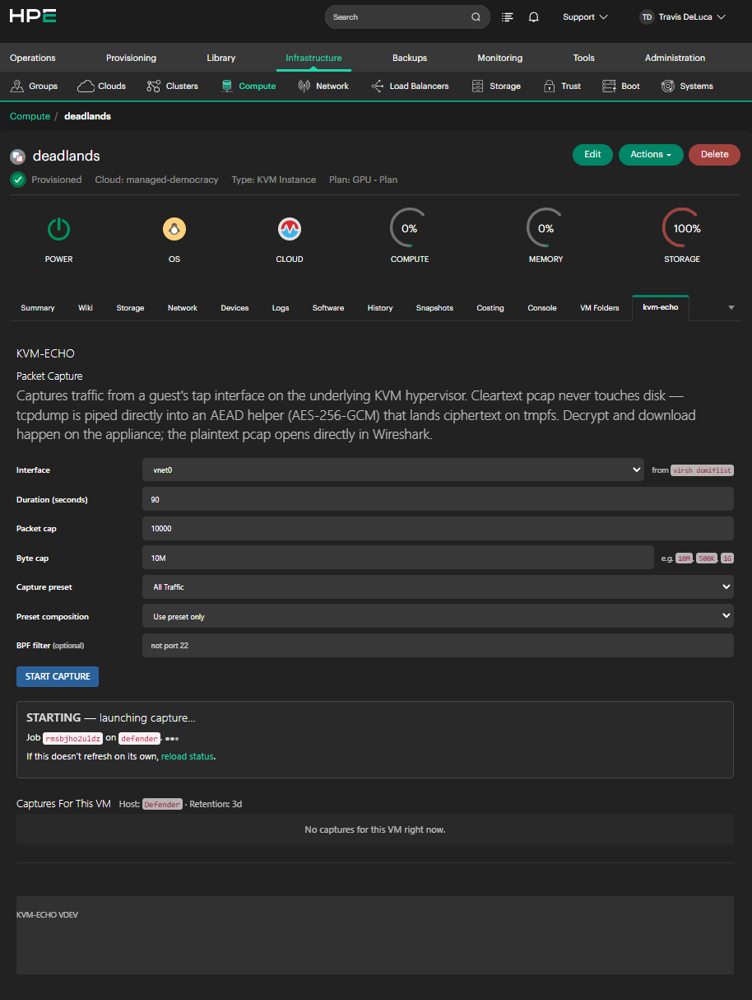
*A capture in progress.*

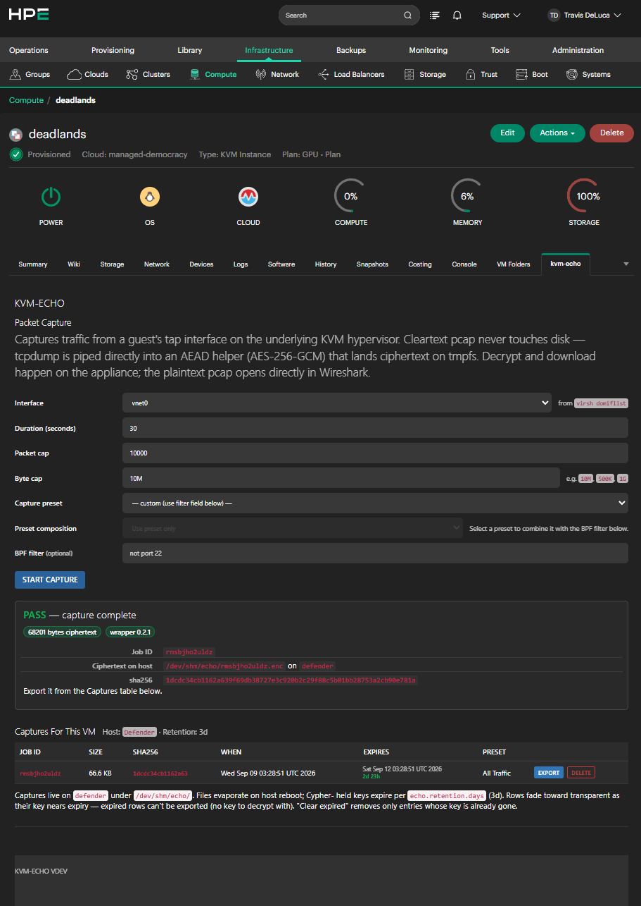
*On success: the jobId, the ciphertext path on the host, its size and SHA-256. The jobId is
the anchor for every log line on both sides — quote it in any bug report.*

---

## Filtering

Every capture can be scoped with a standard `tcpdump` BPF filter. Two ways to set one:

**Pick a preset.** The dropdown offers 48 presets grouped by traffic type — web, remote
access (SSH/RDP/VNC/WinRM), infrastructure (DNS/DHCP/NTP/LDAP/Kerberos/SNMP/syslog),
storage (iSCSI/NFS/SMB/NVMe-TCP/FTP), databases, virtualisation, containers, messaging,
email, and diagnostics (ICMP/ARP/broadcast). Choosing one applies its filter.

**Or write your own.** Leave the preset on `— custom (use filter field below) —` and type a
standard `tcpdump` expression in the BPF filter field, e.g. `not port 22` or
`host 10.0.0.5 and tcp port 443`.

Filters are applied on the host at capture time, before anything is encrypted or written, so
a scoped capture is smaller and contains less than an unfiltered one would.

### A note on filter syntax

Filter text is checked against an allowlist on the host before `tcpdump` runs. It accepts
`tcpdump` keywords (`ip`, `tcp`, `udp`, `port`, `host`, `net`, `portrange`, `and`, `or`,
`not`, and similar), integers, address-shaped values, and parentheses. It rejects shell
metacharacters outright.

Two consequences worth knowing:

- Byte-offset expressions (`tcp[13] & 2 != 0`) and comparisons (`len > 100`) are **not**
  accepted — the characters they need are in the reject list.
- Use the spelled forms `and` / `or` / `not`, never `&&` / `||` / `!`.

A rejected filter fails the capture immediately with a message naming the offending token,
before anything runs.

### Four presets to check before trusting

Most presets are unambiguous standard ports. Four are not, and each says so in the UI when
selected:

| Preset | Caveat |
|---|---|
| `Container / Container registry` | **No filter at all.** There is no correct default — hosted registries are HTTPS/443, private ones commonly 5000 or site-specific. Selecting it falls through to whatever you type in the BPF field. |
| `Storage / vSAN` | Ports move between vSAN releases; ships the 6.7+ set. |
| `Virt / VXLAN overlay` | Covers both 4789 (IANA) and 8472 (Linux/Flannel default). |
| `Virt / vMotion` | Strict vMotion only (TCP 8000). Provisioning/NFC traffic is under the vSphere preset. |

If a preset capture comes back empty, check its note before assuming there was no traffic.

---

## Capturing from an Automation Task or Workflow

This is the scheduled/repeatable surface: a Task you can run on demand, chain into a
Workflow, or attach to a Job schedule.

1. **Library → Automation → Tasks → New Task**
2. Type = **Echo Packet Capture**
3. Configure:
   - **Capture Preset** — same 48 presets as the tab
   - **Custom BPF Filter** — used when the preset is `Custom BPF`
   - **Interface** — **name it explicitly**, e.g. `eno1`, `br0`, or a specific `vnet`. See
     the warning below about `auto`.
   - **Duration**, **Packet cap**, **Byte cap**
4. Set the Execute Target and save
5. Run it against a KVM host

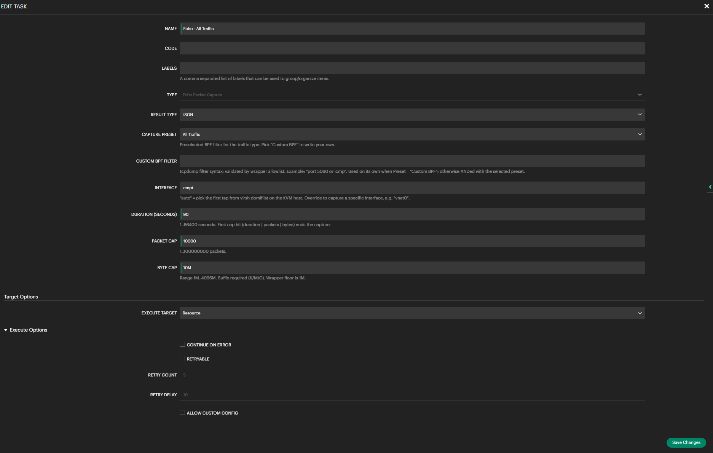
*The Echo Packet Capture task type. These options are read at run time.*

> ### `auto` does not work when the target is a hypervisor
>
> The `Interface` field defaults to `auto`, which resolves by asking libvirt which tap
> belongs to the target **guest**. When the Task targets a KVM host directly there is no
> guest to ask, and the capture fails immediately with `iface is required`.
>
> **Name the interface explicitly** on any Task that targets a host. `auto` only works when
> the target is a VM.

The Task returns a structured result, so a Workflow step after it can reference the capture's
fields — `jobId`, size, SHA-256, and interface — for chaining.

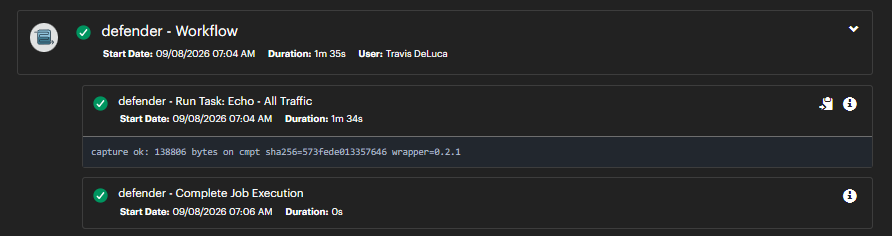
*A Workflow run showing the capture's result line.*

> **Before 0.8.1, Task captures ignored every option you set** and always ran 30 seconds /
> 10,000 packets / 10 MB / unfiltered. If you have Tasks or Workflows created before that
> release, their captures were not taken with the settings shown on the form. The Tasks
> themselves are fine — no need to recreate them, just re-run on 0.8.1 or later.

---

## Exporting and opening a capture

In the Captures table below the form, each row has an **EXPORT** button.

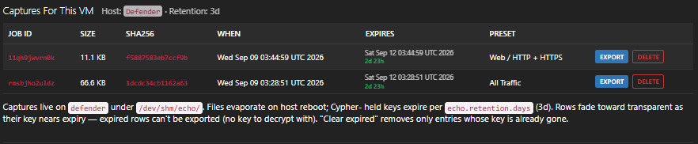
*The Captures table. The PRESET column shows which filter a capture used; rows fade as they
approach expiry.*

1. Click **EXPORT** on the row you want
2. The panel moves FETCHING → DECRYPTING → DOWNLOAD READY
3. Click **DOWNLOAD PCAP** and save the file
4. Open it in Wireshark

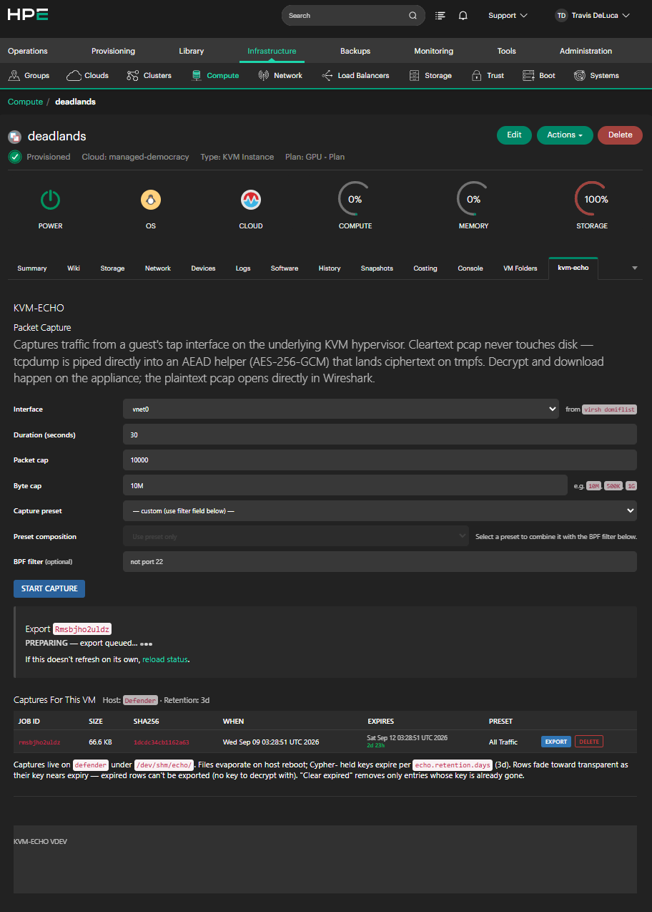
*Export Preparing.*

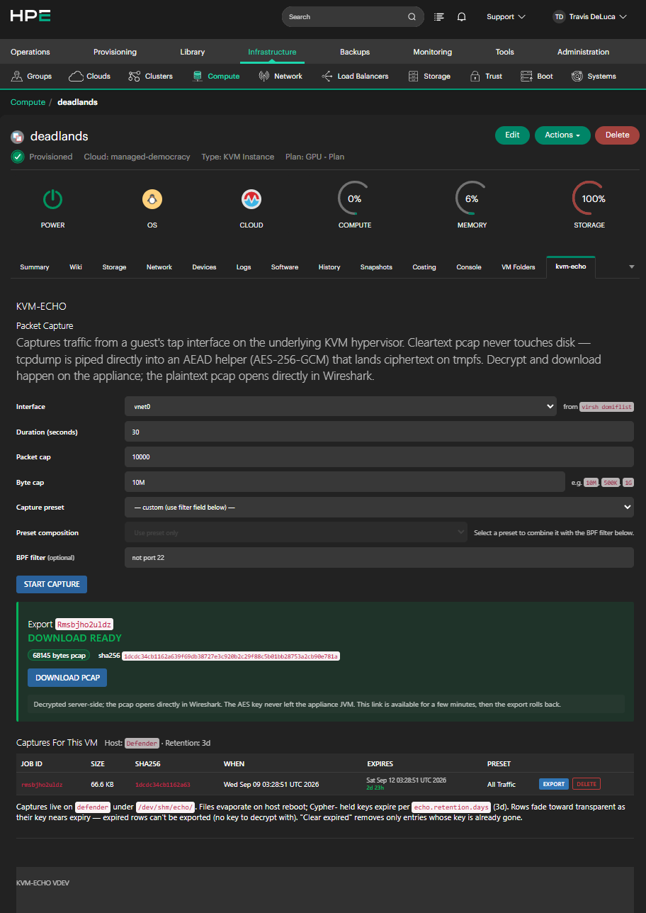
*Export complete. The pcap is decrypted on the appliance and served directly.*

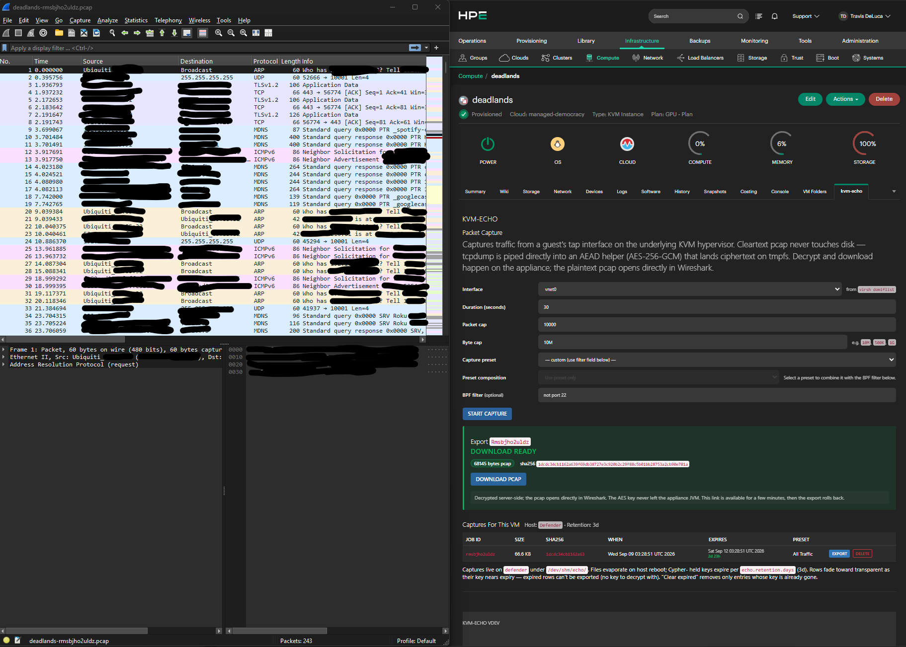
*A decrypted capture open in Wireshark — standard pcap, no conversion step.*

Every export is byte-verified against the host-computed SHA-256 before the decrypt is
attempted, so a corrupted transfer surfaces as a clear integrity failure rather than as a
confusing crypto error.

---

## Retention and expiry

Two separate clocks, and it's worth knowing which is which:

- **The ciphertext** lives on the hypervisor in `/dev/shm` (tmpfs). It survives until the
  host reboots or you delete the row.
- **The AES key** lives in Cypher on the appliance, with a retention window set in the
  plugin's settings (**Administration → Integrations → Plugins → kvm-echo**, default 3 days,
  range 1–90).

**A capture is exportable only while both exist.** Once the key expires the ciphertext is
unrecoverable — that is the design, not a bug. Rows in the Captures table fade as they
approach expiry, so the table itself is the reminder.

A background sweep refreshes the key lease for live captures, including ones taken by
scheduled Tasks that nobody is watching. Delete rows you no longer need — it removes both
the ciphertext and the key.

---

## Known issues (check here first)

** Multi-chunk exports sometimes corrupt in transit**

Symptom: EXPORT FAILED with message like:

```
transfer corrupted: N bytes arrived (correct length) but sha256 differs
— host abc123, received def456
```

The ciphertext gets corrupted somewhere between host and appliance when it's shipped as
base64 over the exec channel. Intermittent — seen on captures in the 165 KB – 700 KB range,
but also seen clean exports at 1.7 MB. Mechanism unidentified; the Morpheus plugin API has
no byte-oriented alternative to replace this transport.

**Workaround:** retry the export. Usually works on second attempt.

** Some captures may say "no key"**

Symptom: EXPORT FAILED with:

```
no key at secret/echo/<jobId> (expired, deleted, or Cypher read permission missing)
```

Two scenarios:

1. Old captures from before the 0.7.6 upgrade — their keys were lost by an earlier
   lease-window bug. Not recoverable. Delete the row.

2. Captures whose Cypher entry lapsed during a plugin restart — if the plugin restarts and
   no one visits the host tab within ~5 minutes, the background sweep loses track of active
   captures. Not recoverable for individual captures. Fix: visit the host tab shortly after
   any plugin restart to trigger re-registration.

Preventive habit: if you're planning to restart the plugin, export any pending captures first.

** `auto` interface fails on hypervisor-targeted Tasks**

Covered above. Name the interface explicitly on any Task whose target is a KVM host.

** The "Preset composition" control is not yet functional**

The capture form shows a **Preset composition** dropdown intended to let a preset and a
custom filter be combined. It is not reachable in this release — leave it alone. Use either
a preset **or** a custom BPF filter, not both.

** Extra Echo task types after upgrading from an early build**

If you have been running pre-release builds, **Library → Automation → Tasks** may offer
`Echo Task Probe` or `Echo Retrieve Capture` alongside the real task type. These are leftover
database records from retired development builds. Selecting one fails at dispatch with a
Morpheus-side error and no plugin log line.

**The correct type is `Echo Packet Capture`.** Morpheus keeps task types after the code
behind them is gone, and there is no plugin-side way to remove them. A fresh install is
unaffected — you will only see this if you upgraded from an early build.

** The plugin tab footer always reads `VDEV`**

It reads a manifest field the build doesn't set. Use **Administration → Integrations →
Plugins** to check the installed version.

** Cypher UI in Morpheus may not load**

Symptom: **Tools → Cypher** shows empty list or fails to load. Appliance-side issue, doesn't
affect the plugin's operation (plugin uses the Cypher API, not the UI).

** Cosmetic layout weirdness**

Detail rows in the panel might look slightly wider than their container. Cosmetic only.

---

## When something else goes wrong

**Every capture and export flow uses a `jobId`** — a random 12-character string that appears
on the PASS panel, in the Captures table row, and in every log line. It's the anchor for
troubleshooting.

### If the tab won't load

- Screenshot of what you see
- Browser console errors (F12 → Console)
- Appliance log tail:
  ```bash
  sudo tail -200 /var/log/morpheus/morpheus-ui/current | grep -iE 'echo|error'
  ```

### If a capture fails

- Screenshot of the FAIL panel
- jobId
- Appliance log for that jobId:
  ```bash
  sudo grep '<jobId>' /var/log/morpheus/morpheus-ui/current | tail -50
  ```
- Host-side wrapper log (SSH to the KVM host):
  ```bash
  sudo cat /dev/shm/echo/<jobId>.log
  sudo cat /dev/shm/echo/<jobId>.status
  ```

### If a Task capture fails but a tab capture works

Check the Interface field first — `auto` does not resolve on hypervisor targets. Then confirm
the options actually reached the capture:

```bash
sudo grep 'runCapture: resolved opts' /var/log/morpheus/morpheus-ui/current | tail -5
```

That line shows the interface, duration, packet cap, byte cap and filter the capture actually
ran with. If it shows `null` for values you set, you are on a release before 0.8.1.

### If an export fails

- Screenshot of the FAIL panel
- jobId
- Appliance log for that jobId
- Whether the plugin was restarted recently before the export

### If preflight is red and remedies don't help

- Screenshot of the preflight panel
- Output of each check manually:
  ```bash
  getcap /usr/bin/tcpdump
  id morpheus-node
  ls -la /dev/shm/
  ```

### If the plugin loads but behavior looks wrong

First: confirm which version is actually loaded, in **Administration → Integrations →
Plugins**. If you upgraded by uploading over the existing plugin rather than removing it
first, you may be running the older code. Remove and re-upload.

Then: screenshot plus browser DevTools inspection of the element in question.

---

## Where logs live

**Appliance:**

- Current: `/var/log/morpheus/morpheus-ui/current`
- Rotated: `/var/log/morpheus/morpheus-ui/@<timestamp>.s`
- Historical grep: `sudo zgrep '<jobId>' /var/log/morpheus/morpheus-ui/@*.s`

**KVM host (per-capture):**

- Wrapper log: `/dev/shm/echo/<jobId>.log`
- Status file: `/dev/shm/echo/<jobId>.status`
- Sidecar: `/dev/shm/echo/<jobId>.meta`
- Ciphertext: `/dev/shm/echo/<jobId>.enc`
- All ephemeral, cleared on host reboot
- Files are root-owned as of 0.7.8 — use `sudo` when inspecting

**KVM host (per-capture tools):**

- `/dev/shm/echo-tools-<jobId>/` (cleared after capture)

---

## Reporting a bug

Open an issue using the [bug report template](../.github/ISSUE_TEMPLATE/bug_report.md) — it
lists everything worth including, so this guide doesn't repeat it here.

The short version: plugin version, Morpheus version, KVM host OS, what you did, what you
expected, what happened instead, and the `jobId` if a capture or export was involved, plus
the appliance and host logs listed above.

If your entire fleet works fine and nothing breaks, that's worth saying too. Boring reports
are useful reports.

For security issues, do not open a public issue — see [SECURITY.md](../SECURITY.md).
